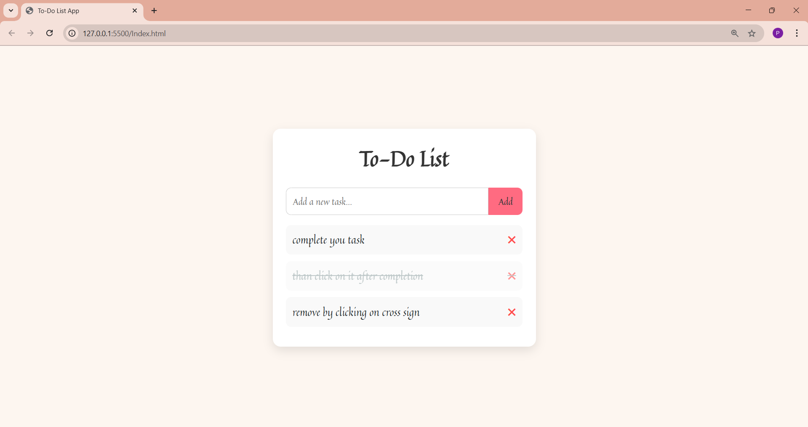

# 📝 To-Do List Web App

A simple and responsive **To-Do List application** built with **HTML, CSS, and JavaScript**.  
This app allows users to **add, delete, and mark tasks as completed**.  
All tasks are stored in **local storage**, so they stay saved even after refreshing the page. 

---

## 📌 Features
- ✅ Add new tasks  
- ✏️ Mark tasks as completed by clicking on them  
- ❌ Delete tasks with one click  
- 💾 Persistent storage using **Local Storage**  
- 📱 Responsive design (works on desktop & mobile)  

---

## 🖼️ Screenshot 
Example:  

---

## ⚡ Tech Stack
- **HTML5**  
- **CSS3**  
- **JavaScript (ES6)**  
- **Local Storage**

---

